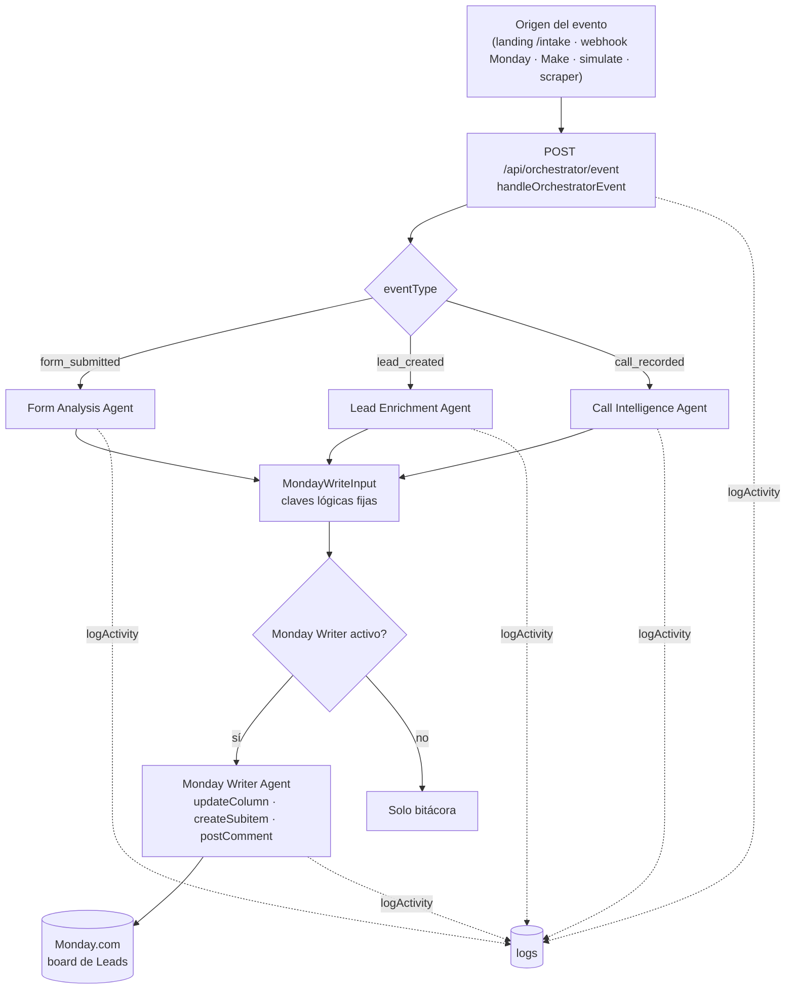
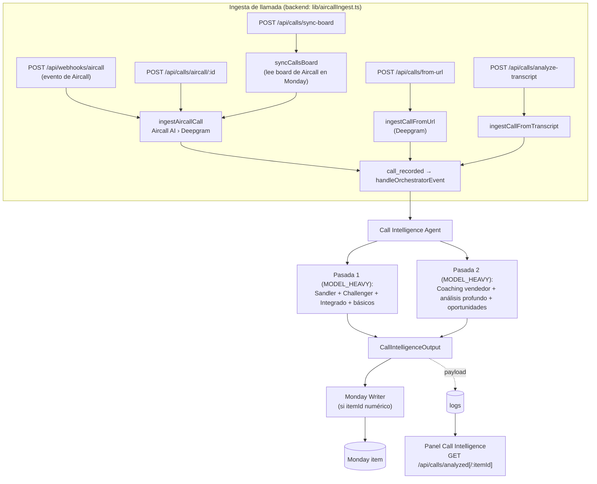
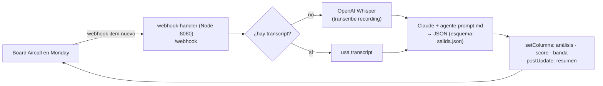
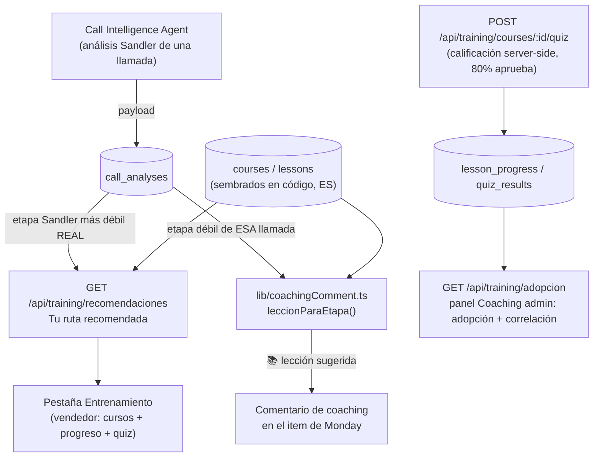

# 04 · Arquitectura

## Componentes

```
maxirent-monday/
├── backend/            API + agentes IA (Node 22 · TypeScript · Express · SQLite/Postgres)
├── frontend/           Panel de control (React · Vite · Tailwind v4)
└── call-intelligence/
    └── webhook-handler/  Servicio Node standalone (Aircall → Whisper → Claude → Monday)
```

- **backend** — expone `/api/*`. Un **Orchestrator** enruta eventos a agentes
  especialistas; el **Monday Writer** es el único que escribe en Monday. Router de
  IA con tres proveedores (claude / gemini / demo). BD con dos drivers
  (SQLite en dev, Postgres si hay `DATABASE_URL`).
- **frontend** — SPA que consume `/api/*` (proxy de Vite en dev, Nginx en prod).
  Reutiliza componentes en las vistas embebidas de Monday (Board/Item View).
- **call-intelligence/webhook-handler** — servicio **independiente** y legado que
  Monday puede llamar cuando entra un item al board de Aircall. El backend
  principal ya reimplementa esta ingesta (`lib/aircallIngest.ts`), por lo que el
  webhook-handler es opcional. Ver [10 · Estado actual](10-estado-actual.md).

## Flujo 1 — Evento de lead → Monday



Cada agente comprueba su propio `status` (`active`/`paused`) en la tabla `agents`
antes de ejecutar; si está pausado, deja un log `warning` y devuelve un
`MondayWriteInput` vacío. La escritura a Monday solo ocurre si el `itemId` es
numérico (guarda de `mondayWriterAgent.ts:62`); los análisis con id no numérico
(`aircall-…`, `url-…`, `call-…`) se guardan solo en la bitácora.

## Flujo 2 — Call Intelligence (Aircall → Claude → Monday)

Hay **dos caminos** hacia el mismo análisis (ambos terminan en `call_recorded`):



### Camino alterno (legado): webhook-handler standalone



## Flujo 3 — Entrenamiento (LMS) y su lazo con Coaching

No es un agente (no hay IA de por medio): es contenido estático servido desde
`courses`/`lessons` y personalizado con datos reales de `call_analyses`.



`POST /api/training/reseed` actualiza el contenido de código conservando el
progreso/quiz existente (re-vincula por título de lección/curso).

## Decisiones de arquitectura (de `CLAUDE.md`)

- En la vista embebida de Monday se muestran **solo Análisis IA + Call
  Intelligence**. Principal / Actualizaciones / Archivos son nativas de Monday: no
  se construyen, se **alimentan** (columnas vía Writer, comentario vía
  `postMondayComment`).
- El rol admin/vendedor viene del SDK de Monday (`me { is_admin }`); en dev se
  puede forzar con `?role=admin|sales`. Desde el 12 jul un vendedor solo ve
  Análisis IA/Prospección/Seguimiento/Entrenamiento (`Layout.tsx`, `main.tsx`).
  **Nota:** este rol solo controla la UI; el backend no lo valida — hallazgo
  vigente [01 · I9](01-analisis-tecnico.md#-i9--la-separación-adminvendedor-no-se-aplica-en-el-backend-vigente).
- **Ya no es cierto que "no haya tabla de análisis".** Desde A.3 (fases 1-3,
  completas) `call_analyses` y `lead_analyses` son el camino de lectura
  principal para Call Intelligence, Leads, Coaching, NBA, Forecast (modo
  estimado) y el Reporte ejecutivo; `logs` quedó como bitácora/auditoría pura
  (con un único fallback legítimo por item para recuperar transcripciones
  viejas). Ver [02 · A.3](02-escalabilidad-roadmap.md) y [08 · Modelo de datos](08-modelo-datos.md).
